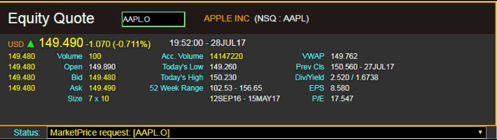

# Real-time Quote Widget example

## Table of Content

* [Overview](#overview)
* [Disclaimer](#disclaimer)
* [Prerequisites](#prerequisites)
* [Package](#package)
* [Running the widget](#running)

## <a id="overview"></a>Overview
The Real-time quote widget is a lightweight web-based interface utilizing capabilities offered within the Elektron RealTime (ERT) streaming services to deliver real-time market data quotes to the browser.  Utilizing popular web technologies such as Angular JS and Twitter Bootstrap, the widget displays a simple equity quote interface showing updates in real-time.  

Details and concepts are explained in the [Building a Real-time Quote widget](https://developers.thomsonreuters.com/article/building-real-time-quote-widget) article published on the [Developer Community portal](https://developers.thomsonreuters.com).  In addition, for an overview of the WebSocket API, you can refer to the Webinar - [Integrating real-time content with the Elektron WebSocket API](https://developers.thomsonreuters.com/content/integrating-real-time-content-elektron-websocket-api) within the Developer Community portal. 



For any question related to this article please use the Developer Community [Q&A Forum](https://community.developers.thomsonreuters.com).

***Note:** To be able to ask questions and to benefit from the full content available on the [TR Developer Community portal](https://developers.thomsonreuters.com) we recommend you to [register here]( https://developers.thomsonreuters.com/iam/register) or [login here]( https://developers.thomsonreuters.com/iam/login?destination_path=Lw%3D%3D).*

## <a id="disclaimer"></a>Disclaimer
The source code presented in this project has been written by Refinitiv only for the purpose of illustrating the concepts of building a simple real-time quote widget.  It has not been tested for a usage in production environments.

## <a id="prerequisites"></a>Prerequisites

Software components used:

* [Elektron WebSocket API](https://developers.thomsonreuters.com/elektron/websocket-api-early-access) - Thomson Reuters interface to access Elektron real-time market data.
* [Angular JS](https://angularjs.org/) (v1.6.5)- Googles Client-side JavaScript framework to build rich HTML applications.  Not only provides an easy and intuitive capability to binding our content within our pages but also animated visual feedback of real-time updates.
* [Bootstrap](http://getbootstrap.com/css/) (v3.3.7) - CSS templates providing useful styles for our display.
* Access to ERT streaming services. 

Browser support: 
* [Any browser](https://kangax.github.io/compat-table/es6/) that supports the [ES2015 specification](https://en.wikipedia.org/wiki/ECMAScript#6th_Edition_-_ECMAScript_2015).

## <a id="package"></a>Package

The package includes the complete source code and necessary dependencies to execute.  You can contact your local Market Data team or Refinitiv representative to provide the necessary setup to connect and test.  Because the package includes the [ERTController](https://github.com/TR-API-Samples/Example.ERT.Javascript.ERTController) submodule, you will need to properly clone using:

`git clone --recursive <URL of this package>`

The application package includes the following:
* **ERTController/ERTWebSocketController.js**

* **ERTController/ERTRESTController.js**

  Generic interfaces to manage authentication to the platform and all communication to the Elektron RealTime (ERT) services.  Refer to the [Example.ERT.Javascript.ERTController](https://github.com/TR-API-Samples/Example.ERT.Javascript.ERTController) project for further details.

* **quoteObject.html, quoteObject.js**

  HTML/JavaScript utilizing the Angular JS framework to build our widget..

* **css / fonts / js**

  Supporting technologies: Angular JS, Bootstrap.

## <a id="running"></a>Running the widget

The quote widget is a single application providing the ability to access the ERT streaming services available within either the Elektron Data Platform (EDP), a locally deployed TREP environment or through your Eikon Desktop installation (future).  Before configuring the specific authentication properties, you will first need to instruct the widget to point to the configuration to determine how you want to access.  

Within *quoteObject.js* file, choose your session:

```javascript
// Application session configuration
// Define the session (TREP, EDP/ERT) you wish to use to access streaming services.  
// To define your session, uncomment the line below:
//      session: undefined
//
// Eg:  session: 'EDP'     // EDP/ERT Session
//      session: 'ADS'     // TREP/ADS Session
app.constant('config', {
   session: undefined,         // 'ADS' or 'EDP'.
```

Once you have specified your session, refer to the specific section below which outlines the steps required to setup and run this widget within the browser.

**Note**: Accessing ERT streaming services within *Eikon* will be provided when services are released and supported within the Eikon desktop..

### TREP/ADS

To setup access to your locally deployed TREP environment, you will need to provide the server and authentication details within the *quoteObject.js* file.  Within the code section, define your properties:

```javascript
// TREP (ADS) session.
// This section defines the connection and authentication requirements to connect
// directly into the streaming services from your locally installed TREP installation.
// Load this example directly within your browswer.
adsSession: {
   wsServer: 'ewa',    // Address of our ADS Elektron WebSocket server.  Eg: 'elektron'
   wsPort: '15000',    // Address port of our ADS Elektron Websccket server. Eg: 15000
   wsLogin: {          // Elektron WebSocket login credentials
      user: 'user',              // User name.  Optional.  Default: desktop login.
      appId: '256',              // AppID. Optional.  Default: '256'
      position: '127.0.0.1',     // Position.  Optional. Default: '127.0.0.1'         
   }
   //wsService: 'ELEKTRON_EDGE',   // Optional. Elektron WebSocket service hosting 
                                   // realtime market data              
},
```

To run the widget, simply load the file within your browser.

### EDP/ERT

Connecting into the cloud from your browser will require the JavaScript to run within a local proxy.  The browser enforces the [***Same-origin***](https://developer.mozilla.org/en-US/docs/Web/Security/Same-origin_policy) policy which is a critical security mechanism to reduce malicious attacks.  

To setup your environment to run the EDT/ERT examples, perform the following steps:

1. Within the installation directory, install [Node.js](https://nodejs.org/en/) modules by executing the following.  

   **Note**: Node.js must be installed on your machine.

   ```
   $> npm install
   ```

   This will create a local directory called node_modules/ containing the modules to run a local HTTP server.

2. Start your server

   ```
   $> node server.js
   ```

   This will start a local HTTP server running on port 8080.

   **Note**: If the machine is behind a proxy server, you need to configure Node.js to use a proxy instead of a direct HTTP connection via the following command in a command prompt:

   ```
   set https_proxy=http://<proxy.server>:<port>
   ```

3. Configure your access within your specific example.  Refer to the section of code that requires the authentication details:

   ```javascript
   // ERT (Elektron Real Time) in Cloud session.
   // This section defines authenticastion to access EDP (Elektron Data Platform)/ERT.
   // Start the local HTTP server (provided) and within your browser, specify the 
   // URL: http://localhost:8080/quoteObject.html
   edpSession: {
       wsLogin: {
           user: undefined,
           password: undefined,
           clientId: undefined
       },
       //wsService: 'ELEKTRON_EDGE',   // Optional. Elektron WebSocket service hosting
                                       // realtime market data 
   ```

4. Load the widget within the browser using the following URL format:

   ```
   http://localhost:8080/quoteObject.html
   ```

### Eikon (future)

### <a id="contributing"></a>Contributing

Please read [CONTRIBUTING.md](https://gist.github.com/PurpleBooth/b24679402957c63ec426) for details on our code of conduct, and the process for submitting pull requests to us.

### <a id="authors"></a>Authors

* **Nick Zincone** - Release 1.0.  *Initial version*

### <a id="license"></a>License

This project is licensed under the MIT License - see the [LICENSE.md](LICENSE.md) file for details
